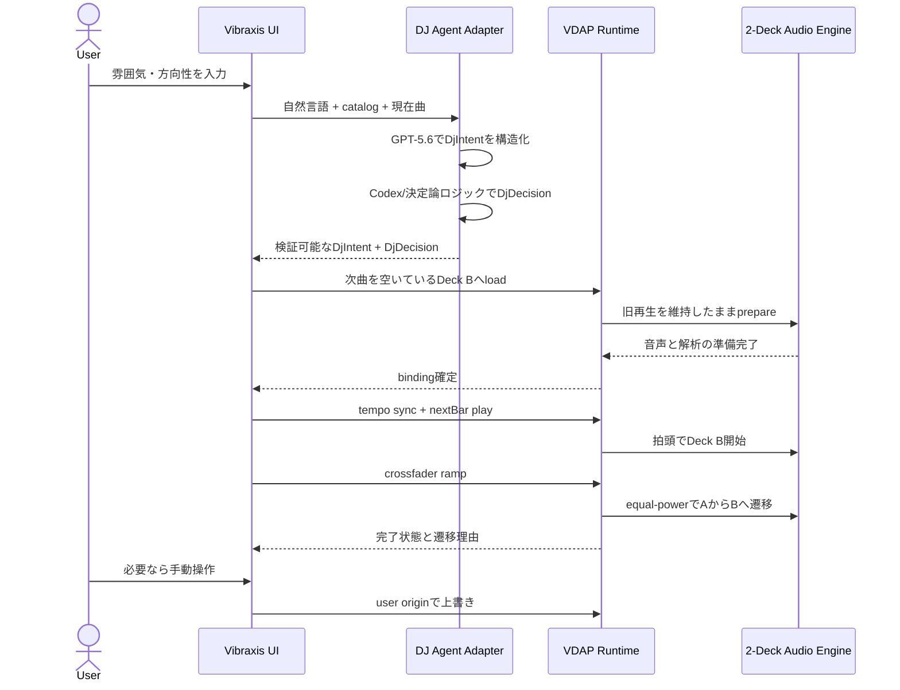

# VDAP仕様実装順 — ハッカソン優先ロードマップ

- 更新日: 2026-07-17
- 対象: Vibraxis DJ Agent ハッカソン実装
- 参照仕様: `Vibraxis DJ Agent Protocol.md`
- 提出ゴール: 2026-07-21 朝までに、3分動画で自律的な2曲間トランジションを安定して見せられる状態

## 1. この文書の役割

VDAP本体は長期的な通信契約を定義する。この文書は、そのうちハッカソンで何を、どの順番で実装するかを固定する実行用ロードマップである。

判断基準は次の順とする。

1. デモ中の無音や暴走を防ぎ、音量操作はユーザー指定をそのまま反映する。
2. Agentが選曲し、次曲を安全に準備し、拍に合わせて滑らかにつなげる。
3. 人間がいつでもAgentを上書きできる。
4. デモで見える、聞こえる、説明できる。
5. 完全なVDAP適合や将来機能は、その後に行う。

ハッカソン実装は当面 **VDAP Draftの内部実装サブセット** と呼び、適合テストを全て通すまでは `core` / `beat` 準拠を名乗らない。

### 現在地

すでに利用できる土台:

- React/Viteの2デッキUIと手動再生
- 手動DJカーブのクロスフェーダー（自動rampはequal-power）
- BPM、キー、Camelot、energy、セクション要約を持つcatalogと、beat/downbeat配列を持つ個別解析JSON
- テンポ同期計算、パフォーマンスパッド、手動override
- VDAP Draftと適合テストマトリクス

まだゴールデンパスを阻んでいるもの:

- UIと`DeckEngine`の間に正準VDAP Runtimeがない。
- staged load、crossfader rampが実エンジンにない。
- Backend、`DjAgentProvider`、決定論的選曲、Codex接続がない。
- VDAP用JSON Schema、共有TypeScript型、解析JSONをRuntimeへ安全に渡すAPIがない。

## 2. デモのゴールデンパス



ゴールデンパスの完了条件:

- Deck Aを再生中にDeck BをロードしてもAの音が止まらない。
- Agentが候補曲から次曲と遷移案を返す。
- GPT-5.6の構造化`DjIntent`が候補順位または遷移方針へ実際に影響する。
- Bが小節頭で開始し、テンポが許容範囲内でAへ合う。
- クロスフェーダーが急変せず、指定拍数で滑らかにAからBへ移る。
- GAIN、EQ、crossfader、MASTER以外の自動音量処理が入らない。
- ユーザーが操作した場合、同じ領域のAgent予約が停止する。
- Codexが利用不能でも決定論的フォールバックで同じデモ経路を継続できる。

## 3. 優先度

| 優先度 | 意味 | 判断 |
|---|---|---|
| **P0** | 実装開始または安全な再生を阻む | これが終わるまで上位機能を増やさない |
| **P1** | ハッカソンの価値を直接見せる | 3分動画に必ず入れる |
| **P2** | 品質・説明力・適合度を上げる | P0/P1が安定してから着手 |
| **P3** | 将来拡張 | ハッカソン後へ送る |

## 4. 実装順サマリー

| 順序 | 優先度 | 成果物 | 依存 | 完了条件 |
|---:|---|---|---|---|
| 0 | P0 | ゴールデンパスを阻むVDAP契約を固定 | なし | §5.1の最小修正が仕様とテスト表へ反映済み |
| 1 | P0 | デモ用JSON Schema・TypeScript型 | 0 | ゴールデンパスのVDAP/解析/Agentデータを機械検証できる |
| 2 | P0 | 正準Runtime StoreとMessagePort縦切り | 1 | UI操作がRuntime経由で1デッキを再生できる |
| 3 | P0 | 透明な2デッキ音声基盤 | 2 | staged load、panic、直接的なミキサー経路が動く |
| 4 | P1 | 最小Beat Transition | 3 | nextBar開始とcrossfader rampで2曲をつなげる |
| 5 | P1 | 決定論的DJロジック | 1 | BPM・Camelot・energyから次曲を選べる。順序2〜4と並行可 |
| 6 | P1 | GPT-5.6 Intent + Codex DJ Agent Provider | 5 | 両モデルが選曲経路で意味のある役割を持ち、失敗時に決定論へfallbackする |
| 7 | P1 | UI統合・E2Eデモ・録画固定 | 2〜6 | ゴールデンパスを3回連続成功させる |
| 8 | P2 | VDAP適合度・高度Beat機能 | 7 | 選択した適合テストが自動実行できる |
| 9 | P3 | Scratch・外部公開・高度解析 | 8 | ハッカソン後の別計画で扱う |

### 進捗トラッカー

順序0→1までは直列で行う。その後は、Runtime/Audioの主経路を順序2→3→4、DJ経路を順序5→6で進め、順序7で合流する。各経路内では最初の未完了項目を次の作業にする。

- [x] 順序0: ゴールデンパスを阻むVDAP契約を固定
- [x] 順序1: デモ用JSON Schema・TypeScript型
- [x] 順序2: 正準Runtime StoreとMessagePort縦切り
- [x] 順序3: 透明な2デッキ音声基盤（staged load・/api/analysis・解析binding・deck.ended済み。音声経路はGAIN → 3-band EQ → crossfader → MASTER → destinationで、自動リミッターや音量補正を挟まない）
- [ ] 順序4: 最小Beat Transition
- [ ] 順序5: 決定論的DJロジック
- [ ] 順序6: GPT-5.6 Intent + Codex DJ Agent Provider
- [ ] 順序7: UI統合・E2Eデモ・録画固定（進行中: 各Deckに中央固定playheadの3バンド拡大スクロール波形と小型全曲overviewを分離し、beat/downbeat/padオーバーレイ、4/8/16/32小節ズーム、両波形からのVDAP seekを実装済み。現在の解析品質ではSECTION/CHORDを波形へ表示しない。共有`TrackTimeline`は拍/小節頭と、取得できたsection/chord-degreeの位置参照を一元化する）
- [ ] 順序8: P2から必要なものを選択（`deck.getGrid`クエリを実装済み: バインド解析のフルビートグリッド[beats/downbeats/bars/sections/phrases＋任意chords]をbinding単位でキャッシュし、高頻度snapshotへは複製しない。`E_DECK_EMPTY`/`E_ANALYSIS_UNAVAILABLE`を規範どおり返す）

各順序で用意する検証コマンド:

| 順序 | コマンド | 合格条件 |
|---:|---|---|
| 0 | `npm run check:protocol-docs` | JSON例、必須語、ゴールデンパス契約の静的検査が成功 |
| 1 | `npm run test:contracts` | VDAP/Analysis/DJ Schemaの正常・異常fixtureが全て期待どおり |
| 2 | `npm run test:runtime` | MessagePort、state、ack/event、権限、panicが成功 |
| 3 | `npm run test:audio` | staged load、解析binding、直接的なミキサー経路、追い越しが成功 |
| 4 | `npm run test:transition` | nextBar、ramp、取消、失敗rollbackが成功 |
| 5 | `npm run test:dj` | scoringとhistoryのunit testが成功 |
| 6 | `npm run test:agent` | GPT-5.6/Codex出力検証とfallbackのintegration testが成功 |
| 7 | `npm run check && npm run demo:smoke` | 全検証とゴールデン経路smokeが成功 |

コマンドがまだ存在しない場合、その順序の最初の小タスクとしてroot `package.json`へ追加する。

## 5. 各段階の実装内容

### 5.1 順序0 — ゴールデンパスを阻むVDAP契約を固定する [P0]

目的: 実装者ごとに異なる解釈を作らない。機能追加ではなく、実装前の契約固定である。

P0で修正するもの:

- `expectedRevision`は受理時だけ検証する。予約実行時は`expectedBindingId`と実行可能条件を再評価する。
- ハッカソンで使う前進/停止の速度を次の概念へ分離する。
  - `baseVelocity`: ユーザー/同期が設定した安定値
  - `configuredVelocity`: override適用後の設定速度
  - `headVelocity`: 再生ヘッドの実速度。pause/endedでは0
  - `direction`: ハッカソン実装は`forward | stopped`のみ
- `effectiveBpm = interpretedBpm × configuredVelocity`とし、停止中も表示/同期用BPMを保持する。
- MessagePortのデモ経路では再送を行わず、1インテントにつき論理終端を1回生成する。汎用再送配送契約はP2で確定する。
- `pendingIntents`をデッキ配下からトップレベルIntent mapへ移し、ミキサー予約も格納する。
- `when`を許可するコマンドをallowlist化する。
- `role`はhelloの自己申告で決めず、MessagePort生成時にRuntimeが`uiPort=user` / `agentPort=agent`を固定する。
- 再生中デッキへのAgent loadは既定拒否とし、明示的な置換指定とbinding前提条件がある場合だけ許可する。
- `mixer.rampCrossfader`をBeat Extensionのゴールデンパス契約として追加する。

`mixer.rampCrossfader`で順序0に確定するもの:

- params: `{to, duration:{bars|beats|seconds}, curve:"equalPower", referenceDeckId?}`
- `bars` / `beats`使用時は`referenceDeckId`必須。受理時と実行中に参照デッキの進行可能性を検証する。
- `when`は開始時刻を表し、`duration`は開始後の長さを表す。
- 競合ドメインはmixer `crossfader`。同ドメインのuser操作は進行中automationを取消し、現在の手動値をbase/effectiveへ採用する。
- rampは1つのIntentで、automation完了時に`intent.completed`、user操作・panic・client cancel時に`intent.cancelled`となる。
- 終端結果には`from`, `to`, `startedAtRuntimeTime`, `endedAtRuntimeTime`, `durationSeconds`を含める。

`when`のハッカソンallowlist:

| コマンド | immediate | nextBeat/nextBar | 理由 |
|---|---:|---:|---|
| `deck.play`, `deck.pause`, `deck.seek`, `deck.selectPad` | Yes | Yes | 拍に合わせたトランスポート操作 |
| `deck.setGain`, `deck.setVelocity`, `deck.sync` | Yes | Yes | 遷移準備 |
| `mixer.setCrossfader`, `mixer.rampCrossfader` | Yes | Yes | ミックス本体 |
| `deck.setTempoInterpretation`, `mixer.setMasterGain` | Yes | No | P0では即時設定のみ |
| `deck.load`, `deck.unload` | Yes | No | ロードは事前準備であり、時刻予約しない |
| `state.subscribe`, `state.unsubscribe` | Yes | No | 接続管理を予約しない |
| `schedule.cancel`, `runtime.panic` | Yes | No | 取消・緊急停止は即時のみ |
| パッド編集コマンド | Yes | No | 状態編集と演奏操作を混同しない |

完了条件:

- 上記P0規則が`Vibraxis DJ Agent Protocol.md`の本文、エラー、状態例、ゴールデンパス用テストで矛盾しない。
- RFC 6902、staged load、`sourcePosition`の既存修正を維持する。
- 文書中のJSON例が全てparseできる。

P0で扱わないもの: reverse/Scratch、汎用delta再送順序、複数小節pickup、`tempoPhase` / `tempoBar`、全コマンドの完全Schema。これらはP2/P3へ送る。

### 5.2 順序1 — デモ用JSON Schema・TypeScript型 [P0]

目的: UI、Runtime、Agent Adapterを別々に実装してもガッチャンコできる正本を作る。

予定成果物:

```text
shared/
  analysis/
    analysis.schema.json
    index.ts
  vdap/
    envelope.schema.json
    state.schema.json
    command.schema.json
    event.schema.json
    index.ts
  dj/
    intent.schema.json
    decision.schema.json
    index.ts
```

最低限定義する型:

- `VdapRequest`, `VdapAck`, `VdapEvent`, `VdapSnapshot`
- `RuntimeState`, `DeckState`, `MixerState`, `IntentState`, `TrackBinding`
- ゴールデンパスで使うコマンド
- `TrackAnalysis`とbeat/downbeat/sectionのRuntime入力型
- `DjContext`, `DjIntent`, `DjDecision`, `TransitionPlan`
- 安定エラーコードとreason

`DjDecision`は高水準判断に限定する。

```ts
type DjDecision = {
  nextTrackId: string;
  targetDeckId: "A" | "B";
  tempoSync: "none" | "tempo";
  startAt: "nextBar";
  crossfadeBars: number;
  confidence: number;
  reasons: string[];
};
```

Agentに低水準の任意コマンド列、ファイルURL、直接的なWeb Audio操作を生成させない。Adapterが`DjDecision`を検証してVDAPコマンドへ変換する。

完了条件:

- ゴールデンパスの正常例と異常例をSchemaで検証できる。
- `analyze-tool`とTypeScript側が同じAnalysis Schemaを正本として参照する。
- UIとBackendが同じTypeScript型をimportできる。
- `npm run check`にSchema/型検証が含まれる。

全VDAPコマンド・全仕様例のSchema化はP2とし、順序1をブロックさせない。

### 5.3 順序2 — 正準Runtime StoreとMessagePort縦切り [P0]

目的: React stateや`DeckEngine`を状態の権威にせず、UIとAgentが同じ契約で操作できるようにする。

推奨構成:

```text
frontend/src/runtime/
  RuntimeStore.ts
  IntentManager.ts
  CommandDispatcher.ts
  MessagePortTransport.ts
  createRuntime.ts
```

最初に実装する縦切り:

1. UIがMessagePortで`session.hello` / `state.get`を送る。
2. UIが`deck.load` / `deck.play` / `deck.pause`を送る。
3. Runtimeがack、状態更新、終端eventを返す。
4. UIはRuntime snapshotだけを表示に使う。

ブラウザ内には権限の異なる2つの論理クライアントを作る。

- `uiPort`: Runtimeがorigin `user`を割り当て、手動操作に使う。
- `agentPort`: Runtimeがorigin `agent`を割り当て、検証済み`DjDecision`から変換したコマンドに使う。

同じUIプロセス内にあってもポートを共用しない。これによりuser操作がAgent予約を確実に上書きできる。

この段階では外部WebSocketを実装しない。ブラウザ内MessagePortで契約と音声制御を先に安定させる。

完了条件:

- UIから`DeckEngine`への直接ミューテーションがゴールデンパス上に残っていない。
- request → ack → 状態更新 → terminal eventの順をテストできる。
- user originが同一ドメインのAgent予約を取消せる。
- `runtime.panic`で両デッキと予約を即時停止できる。
- `npm run check`が通る。

### 5.4 順序3 — 透明な2デッキ音声基盤 [P0]

目的: 操作値を隠れて補正しない透明な音声経路と、失敗を明示するロード処理を提供する。

実装項目:

- `CatalogTrack`へ`analysisFile`を追加し、`GET /api/analysis/{trackId}`を実装する。サーバー側でcatalogからパスを解決し、任意ファイルパスは受理しない。
- load時に音声と解析JSONを並行取得し、共有Analysis Schemaで検証してから同じbindingへcommitする。
- staged load: 新音源を別領域でfetch/decodeし、成功時だけbindingを交換する。
- load generation: 追い越されたdecode結果をcommitしない。
- 再生中デッキへのAgent loadを既定拒否する。
- 位置ペア`{sourceSeconds, atRuntimeTime}`と`headVelocity`をRuntimeから配信する。
- 音声経路をGAIN → 3-band EQ → crossfader → MASTER → destinationとし、自動ゲイン補正、リミッター、コンプレッサー、強制ceilingを挟まない。
- 手動操作は中央ユニティのDJカーブ、自動rampはequal-powerとして分離する。
- AudioContext lock、decode失敗、曲末端を安定エラーへ写像する。

クリップの可能性は音量へ自動介入せず、必要な場合は状態表示だけで通知する。

完了条件:

- 明示的な置換を許可して再生中の同一デッキXへloadし、そのloadが失敗しても、Xの旧bindingId・音声・transport・外挿位置が連続する。
- 連続した2ロードでは後発だけがcommitされる。
- catalogの全trackIdについて解析APIが対応する解析JSONを返し、未知IDと不正Schemaを拒否する。
- 音声グラフに自動的な増減衰やダイナミクス処理がなく、操作値が各ノードへそのまま反映される。
- panicが50ms目標で停止する。
- audio関連Vitestと`npm run check`が通る。

### 5.5 順序4 — 最小Beat Transition [P1]

目的: 「ただ曲を切り替える」のではなく「DJとしてつなぐ」をデモで聞かせる。

実装順:

1. 順序3で取得・検証した`beatsSeconds` / `downbeatsSeconds`をbindingから参照する。
2. 参照デッキの位置ペアから`nextBar`のRuntime時刻を求める。
3. Deck Bを`nextBar`で開始する。
4. tempo-only syncでBのplayback rateを設定する。
5. `mixer.rampCrossfader`を実装する。
6. ramp完了後にAをpauseする。

`DjDecision`を個別コマンドへ変換して完遂する責務は`TransitionExecutor`へ集約する。

```text
frontend/src/runtime/transition/
  TransitionExecutor.ts
  TransitionExecutor.test.ts
```

`TransitionExecutor`の処理順:

1. active/inactiveデッキと現在bindingを記録する。
2. inactiveデッキのload完了を待ち、確定bindingIdを取得する。
3. tempo syncを適用し、可動域と解析前提を確認する。
4. 1つの`nextBar`境界を確定し、同じ境界をinactiveデッキのplayとramp開始に使う。
5. ramp成功後だけactiveデッキをpauseし、遷移完了とする。
6. 途中失敗時は未実行Intentとautomationを取消し、inactiveデッキをpause、crossfaderをactive側へ戻し、activeデッキの旧bindingと再生を維持する。
7. 各段階で`expectedBindingId`を再検査し、user overrideを最優先する。

`mixer.rampCrossfader`の最小形:

```ts
type RampCrossfaderParams = {
  to: number;
  duration: { bars: number } | { beats: number } | { seconds: number };
  curve: "equalPower";
  referenceDeckId?: "A" | "B";
};
```

Web Audioのautomationを使い、細かな`setCrossfader`予約の連打で近似しない。

フォールバック:

- downbeat confidence不足: 次beatまたは秒指定の遷移へ低下し、UIへ表示する。
- tempo同期が可動域外: クランプ結果を表示し、無理な同期を隠さない。
- `tempoInterpretation != normal`: phase/bar同期は行わずtempo-onlyへ低下する。

完了条件:

- 検証済み音源2曲でBが目標小節頭から±10ms以内に開始する。
- 4または8小節のramp所要時間誤差が±10ms以内である。
- automation曲線上でA gainは単調非増加、B gainは単調非減少、全点で`abs(gainA² + gainB² - 1) ≤ 0.01`を満たす。
- ramp中のuserクロスフェーダー操作でAgent rampが取消される。
- load成功後・sync後・play予約後・ramp中の各失敗を注入しても、未実行Intentが残らず、旧曲または安全な片側デッキの再生へ戻る。
- 3回連続で無音・二重再生事故なく遷移できる。

### 5.6 順序5 — 決定論的DJロジック [P1]

目的: Codexがなくてもデモと音楽制御が成立する基準系を作る。

候補スコア:

- BPM差または同期後playback rateの安全性
- Camelot互換性
- energyの方向性
- 同じ曲・直近履歴の除外
- セクション/CUEの利用可否

決定論的ロジックが返すものは`DjDecision`だけとし、再生は`TransitionExecutor`が行う。

完了条件:

- 同じ入力には同じ順位を返す純関数である。
- 理由を機械可読な項目として返す。
- 不適切な候補を除外し、候補0件を明示的に扱う。
- VitestでBPM、Camelot、energy、履歴除外を検証する。

### 5.7 順序6 — GPT-5.6 Intent + Codex DJ Agent Provider [P1]

目的: 自然言語の意図解釈と選曲理由を追加し、VibraxisのAI Agent価値を見せる。

推奨経路:

```text
Browser UI
  -> POST /api/agent/decide
  -> Node/TypeScript Backend
  -> Gpt56IntentProvider (自然言語 -> DjIntent)
  -> Deterministic scoringで候補を絞る
  -> CodexLocalProvider (@openai/codex-sdk、候補 -> DjDecision)
  -> JSON SchemaでDjIntent/DjDecision検証
  -> Browser UI
  -> agentPort経由でVDAP Runtimeへ適用
```

この経路なら、ハッカソン中に外部WebSocket制御を完成させなくてもNode上のCodex SDKとブラウザRuntimeを結合できる。

画面上の手動操作は`uiPort`、Agent判断の適用は`agentPort`を使い、Backendから返った判断をuser権限として実行しない。

Provider境界:

```ts
interface DjIntentProvider {
  interpret(input: UserDjRequest): Promise<DjIntent>;
}

interface DjAgentProvider {
  decideNext(input: DjContext, intent: DjIntent): Promise<DjDecision>;
}
```

ハッカソンでの責務を次で固定する。

- **GPT-5.6は提出必須のP1機能**。`Gpt56IntentProvider`がユーザーの自然言語からenergy方向、mood/genre希望、遷移の緊急度、説明用要点を`DjIntent`としてStructured Outputする。
- `DjIntent`は候補スコアの重みまたは除外条件へ必ず使い、単なる説明文生成にしない。
- **CodexLocalProvider**は絞り込まれた候補、現在曲、履歴、`DjIntent`を読み、次曲と遷移案を`DjDecision`として返す。事前の`codex login`を使うローカル単一ユーザー構成とする。
- `DeterministicProvider`は安全な候補順位と両AI機能のfallbackを担う。
- ローカル開発は片方の認証がなくてもfallbackで動かせるが、提出動画ではGPT-5.6とCodexの両方が実経路で動くテイクを使用する。
- APIキーなしのCodex Local + deterministic構成は開発・ローカル利用モードとして残すが、GPT-5.6必須のハッカソン提出完了とは扱わない。
- 動画、README、提出文では両者の異なる責務と、実際に判断へ与えた影響を明示する。

実装順:

1. `DeterministicProvider`
2. `Gpt56IntentProvider`
3. `CodexLocalProvider`
4. timeout・認証失効時のfallback

安全規則:

- Codexの作業ディレクトリをVibraxisへ限定する。
- 認証情報をアプリへコピー・表示・保存しない。
- GPT-5.6とCodexの出力をそれぞれSchemaで再検証する。
- Agentに音源URL、任意VDAPコマンド、シェル操作を出力させない。
- 片方のtimeout/認証失効時は`DeterministicProvider`へ戻り、Runtimeを待たせない。

完了条件:

- APIキー設定環境でGPT-5.6がSchema適合`DjIntent`を返し、異なるユーザー意図で候補順位または遷移方針が変わる。
- ログイン済み環境でCodexがSchema適合`DjDecision`を返す。
- 未ログイン・API失敗・timeout・不正出力で決定論的providerへ戻る。
- UIに「GPT-5.6 Intent」「Codex Decision」「Fallback」を区別して表示する。
- 音声スレッド/RuntimeがAgent応答待ちで停止しない。
- `提出計画.md`、README、動画台本がGPT-5.6とCodexのmeaningful useを正確に説明する。

### 5.8 順序7 — UI統合・E2Eデモ・録画固定 [P1]

目的: 機能を完成させるだけでなく、審査員が3分で価値を理解できる形にする。

UIで見せるもの:

- 現在曲と次曲
- BPM、キー/Camelot、energy
- Agentの選曲理由とconfidence
- 「PREPARING」「READY」「SYNCED」「MIXING」の遷移状態
- 次の小節までのカウント
- GPT-5.6 Intent、Codex Decision、Fallbackの区別
- user overrideによる予約取消

デモ固定条件:

- 著作権条件を確認した3曲以上のゴールデンセットを使う。
- BPM/downbeat/ゲインを耳と波形で確認し、必要ならoverrideする。
- 1コマンドで起動できる。
- 冷起動からデモ終了までを3回連続で通す。
- 毎日録画し、最良テイクを確保する。

完了条件:

- `npm run check`が通る。
- 新設する`npm run demo:smoke`が主要APIとcatalogを確認する。
- ゴールデンパスを3回連続成功する。
- GPT-5.6 + Codex有効版とfallback版の両方を1回以上録画する。
- 動画音声とREADMEでGPT-5.6とCodexの異なるmeaningful useを説明する。
- READMEの起動手順が新しいPCを想定して3コマンド以内である。

## 6. P2 — P0/P1完了後に行うもの

優先順:

1. `tempoPhase` / `tempoBar`の位相同期
2. half/double解釈に対応する位相グリッド規則
3. RFC 6902 delta購読と「delta後に同revisionのterminal event」配送規則
4. requestId冪等キャッシュ、at-least-once配送、クライアント重複排除テスト
5. `ended`からのplay規則と複数小節pickup座標
6. 全VDAPコマンド・全仕様例のSchema化と自動適合テスト生成
7. 外部Node Agent用WebSocket Transport
8. role付きtoken、Origin検査、メッセージサイズ・rate limit
9. URL loadのscheme/host/容量/time limit
10. セクション・phraseを用いたmix point選択
11. パフォーマンスパッドの自動割当改善
12. `sourcePosition`スケジューリング

外部WebSocketをP2に置く理由: ハッカソンのCodex ProviderはHTTPで判断を返し、ブラウザ内の検証済みAdapterがMessagePortでRuntimeを操作できるため。通信経路を増やすより、音の完成度を優先する。

## 7. P3 — ハッカソン後へ送るもの

- Scratch / reverse playback / AudioWorklet playhead
- gestureファイルとcrossfader gate連携
- ChordMini等によるコード進行・セクション高度解析
- degree nameによるコード進行マッチング
- 継続tempo follow
- loop、ISOLATOR/advanced EQ、FX、key lock（通常の3-band EQは順序7で実装済み）
- 外部クライアントへの正式なVDAP公開
- リモート/マルチユーザー認証
- ホスト版・ストリーミングサービス連携
- VDAP全プロファイル適合宣言

P3の項目は、P0/P1の設計を壊さないため仕様上の拡張点だけ維持し、ハッカソン中は実装しない。

## 8. 並行作業できる境界

順序1のSchemaと型が固まった後、以下は並行化できる。

| 作業レーン | 担当範囲 | 合流点 |
|---|---|---|
| Runtime | Store、Intent、MessagePort、権限、panic | shared VDAP型 |
| Audio | staged load、位置ペア、透明なミキサー経路、ramp | RuntimeのAudio Adapter interface |
| DJ Logic | scoring、history、`DjDecision` | shared DJ型 |
| Agent | Backend、Codex provider、fallback | `DjAgentProvider` interface |
| UI | 状態表示、Agent理由、mix表示 | Runtime snapshot + `DjDecision` |
| Analysis/Data | ゴールデン曲のBPM/downbeat/section補正 | catalog/analysis schema |

並行作業中の禁止事項:

- 各レーンで独自の似た型を作らない。
- React state、Backend state、Audio engine stateを別々の権威にしない。
- Agent出力を検証せずRuntimeへ渡さない。
- Schema変更を共有せず片側だけで進めない。

## 9. 中止基準と切り捨て順

時間不足時は次の順で切る。

1. phase/bar位相同期を切り、tempo-only + nextBar開始へ落とす。
2. Codexの複数ターン会話を切り、1リクエスト1判断へ落とす。
3. deltaを切り、MessagePort内のsnapshot更新へ落とす。
4. 外部WebSocketを完全に切る。
5. 高度セクション解析を切り、手動CUE/overrideへ落とす。
6. UI機能を切り、ゴールデンパスの表示だけ残す。

切ってはいけないもの:

- staged load
- crossfader ramp
- 透明な音声経路（自動ゲイン補正・ダイナミクス処理なし）
- user override / panic
- Agent出力Schema検証
- 決定論的fallback
- ゴールデンパスの自動/手動テスト

## 10. 作業開始時のチェックリスト

各作業は次を満たしてから開始する。

- [ ] この作業が順序表のどこに属するか明示した。
- [ ] 依存するSchema/型が確定している。
- [ ] 完了条件とテストコマンドを決めた。
- [ ] ゴールデンパスにどう効くか説明できる。
- [ ] P2/P3の作業を混ぜていない。
- [ ] 失敗時に既存再生を壊さない。

## 11. ハッカソン完了条件

次の全てを満たした時点で実装を凍結し、動画・README・提出へ移る。

- [ ] 2曲間の自動遷移を3回連続成功できる。
- [ ] 再生中の同一デッキXへの明示置換loadが失敗しても、Xの旧binding・音声・位置が継続する。
- [ ] Bが目標拍/小節境界から±10ms以内に開始する。
- [ ] crossfader rampの時間誤差が±10ms以内で、equal-power単調曲線のテストを通る。
- [ ] GAIN、EQ、crossfader、MASTERの操作値が自動補正されず音声ノードへ反映される。
- [ ] user overrideとpanicが機能する。
- [ ] GPT-5.6 Intent、Codex Decision、決定論的fallbackの3経路が動く。
- [ ] READMEと3分動画の音声で、GPT-5.6とCodexのmeaningful useを説明している。
- [ ] `npm run check`とデモsmoke testが通る。
- [ ] 起動手順が3コマンド以内である。
- [ ] 3分動画の素材が確保できている。

この完了条件を満たした後にだけ、P2へ進む。
